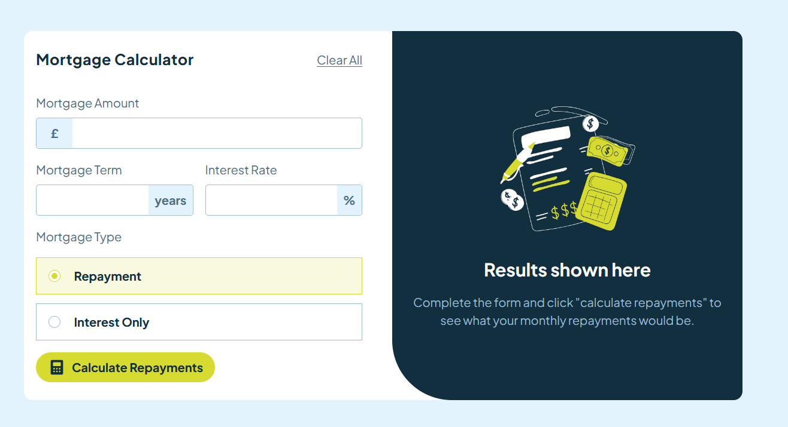
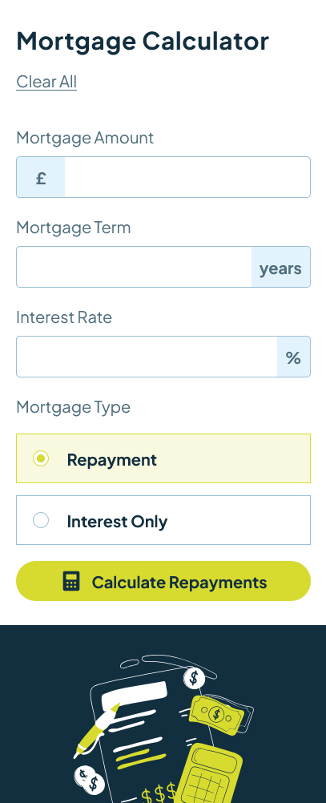

# Frontend Mentor - Mortgage repayment calculator solution

This is a solution to the [Mortgage repayment calculator challenge on Frontend Mentor](https://www.frontendmentor.io/challenges/mortgage-repayment-calculator-Galx1LXK73). Frontend Mentor challenges help you improve your coding skills by building realistic projects. 

## Table of contents

  - [The challenge](#the-challenge)
  - [Screenshot](#screenshot)
  - [Links](#links)

  - [Built with](#built-with)
  - [What I learned](#what-i-learned)

- [Author](#author)

### The challenge

Users should be able to:

- Input mortgage information and see monthly repayment and total repayment amounts after submitting the form
- See form validation messages if any field is incomplete
- Complete the form only using their keyboard
- View the optimal layout for the interface depending on their device's screen size
- See hover and focus states for all interactive elements on the page

### Screenshot

### Links

- Solution URL: [https://github.com/RodneyTakundaMadondo/Mortgage-Repayment-Calculator.git]
- Live Site URL: [Add live site URL here](https://your-live-site-url.com)

### Built with

- Semantic HTML5 markup
- CSS custom properties
- Flexbox
- TailwindCss
- Mobile-first workflow
- [React](https://reactjs.org/) - JS library

### What I learned
I learned how to work with forms using reactjs. It is unbelievably easy to work with forms when using React.

## Author

- Website -(https://rodneytakundamadondo.github.io/Portfolio/)
- Frontend Mentor - [@RodneyTakundaMadondo](https://www.frontendmentor.io/profile/RodneyTakundaMadondo)

